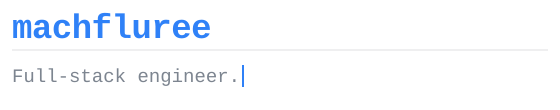

<!--
  GitHub Profile README
  Repo name must match your username exactly: machfluree/machfluree

  Every image here is served from this repo. Nothing external can take it down.
    ./assets/header.svg  - animated header, hand-written, static file
    ./profile/*.svg      - stats cards, regenerated daily by
                           .github/workflows/profile-cards.yml
-->

  
  
  <!--  -->

---

### About

I like systems that hold up under real traffic, code that still reads well six months later, and the occasional weekend rabbit hole.

- 🔬 **Exploring** — AI tooling, agents, and everything that comes with them
- 📈 **Learning** — how to invest with a plan instead of a vibe
- 🤝 **Open to** — full-stack collabs, especially anything gnarly and ambitious
- 🌾 **Genuinely need help with** — setting up a farm. Not a metaphor.
- 💬 **Ask me about** — whatever you're deep in right now. I'll probably have thoughts.
- 🐈 **Fun fact** — your cat has, at best, filed you under "warm furniture that opens cans."

---

### Stack

  
  
  
  

---

### Stats

---

<b>Currently building</b>

 

| Project | What it is | Status |
| --- | --- | --- |
| [project-one](https://github.com/machfluree) | One line on what it does | 🟢 Active |
| [project-two](https://github.com/machfluree) | One line on what it does | 🟡 Slow burn |
| [project-three](https://github.com/machfluree) | One line on what it does | 🔵 Shipped |

<b>Things I believe about software</b>

 

- Boring technology wins more often than it loses.
- If it isn't in version control, it doesn't exist.
- The best abstraction is the one you didn't need to write.
- Most performance problems are a query you haven't looked at yet.

 
Open to interesting problems — the inbox is up there. ↑

